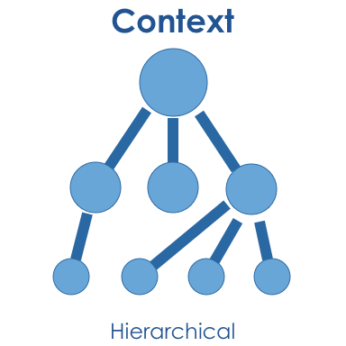

# Context
The context is one of the three major components of Miruken.  The other two major components being the protocol and the handler.

```
    CreatingAContext.cs
```

At the simplest level a context is a collection of handlers. You can simply add instances of handlers to a context.

```
    AContextWithHandlerInstances.cs
```

You can also rely on a container to create the handler instance.  We like to use Castle Windsor, 
but as you can see by this example all you need is a handler that implements `IContainer`.
This means you can use any container you choose.

```
    RelyingOnAContainerToResolveHandlers.cs
```

## Hierarchical
Contexts are also hierarchical. They know their parent and can create children.



```
- Context.CreateChild
```

### Traversal

Traversal is the concept of finding a handler for a message in the current context.

By default when Miruken is trying to handle a message it starts with the current context. If the current context cannot handle
the message, the message will be passed to the parent to be handled.

## Lifecycle

- Context.End
- Context.Ended

