=======
Context
=======

The context is one of the three major components of Miruken.  The other two major components being the protocol and the handler.

In this example we are simply creating a new context:

.. literalinclude:: ../../examples/mirukenExamples/context/creatingAContext.cs

At the simplest level a context is a collection of handlers.

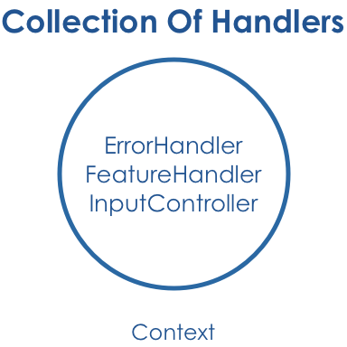

Here we are instantiating handlers and adding them to the context: 

.. literalinclude:: ../../examples/mirukenExamples/context/aContextWithHandlerInstances.cs

You can also rely on a container to create the handler instances.  We like to use Castle Windsor,
but as you can see by this example you can use any container you want. 
All you need is a handler in the context that implements `IContainer` 
and it will create the handler instances for you. My simple container here just instantiates instances and returns them. 

.. literalinclude:: ../../examples/mirukenExamples/context/relyingOnAContainerToResolveHandlers.cs
   :end-before: //end
   :append: ...

Hierarchical
------------

Contexts are also hierarchical. They have a context graph witch mean they know their parent and can create children.

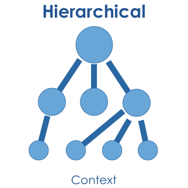

In this example we use the CreateChild() method to create a child context from an existing context:

.. literalinclude:: ../../examples/mirukenExamples/context/creatingAChildContext.cs

Context Traversal
-----------------

Context traversal is the concept of finding a handler for a message in the current context graph.

SelfOrAncestor is the default TraversingAxis which means that when Miruken is trying to handle a message it starts with the current context. If the current context cannot handle the message, the message will be passed to the parent to be handled. There are several other TraversingAxis. You can see them all described below.

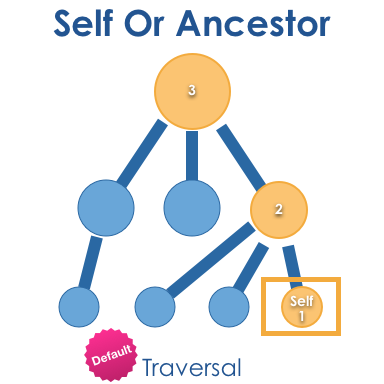

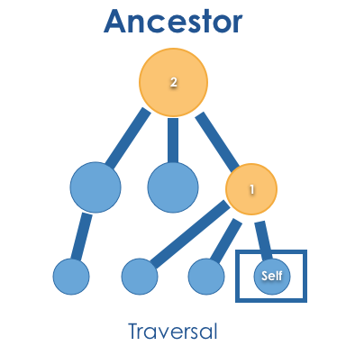

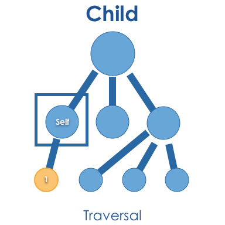

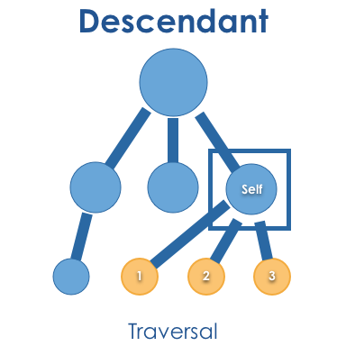

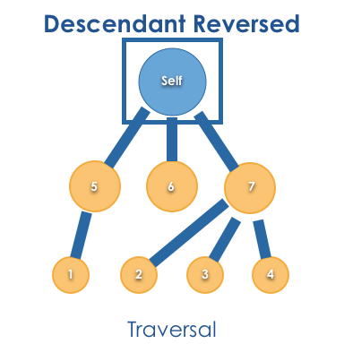

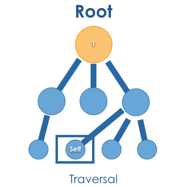

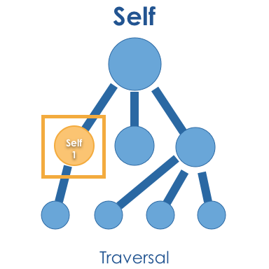

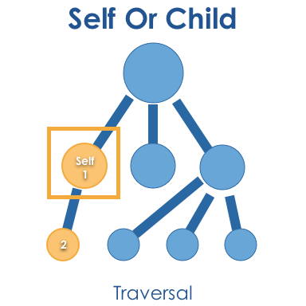

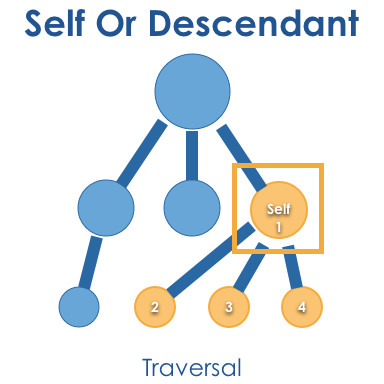

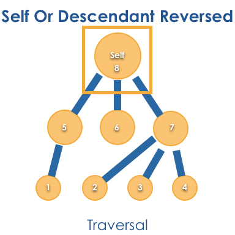

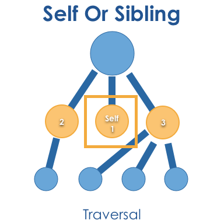

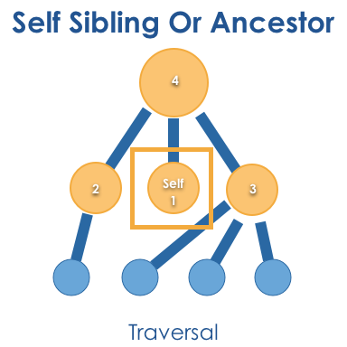

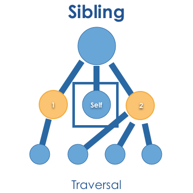

Lifecycle
---------

- Context.End
- Context.Ended

